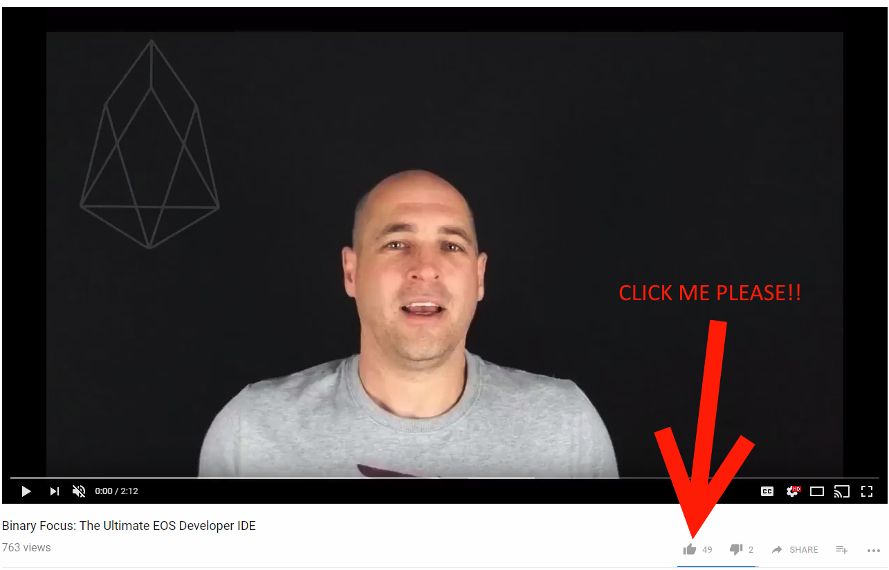

# EOSDocs.io

## Summary

EOSDocs.io is a collaborative effort between [EOS New York](https://www.eosnewyork.io/) and Binary Focus.

This is an Open Source project which encourages the community to contribute to exceptional EOS documentation. 

It's easy to contribute / edit the documentation - [lean how](/howtoedit)

## Support the cause

I'd like to go to the [Hong Kong hackathon](https://eoshackathon.io/) and continue to build amazing EOS tools that support developers. You can help my cause, but clicking on the image below and clicking on the Thumbs up / I like this video button. 

