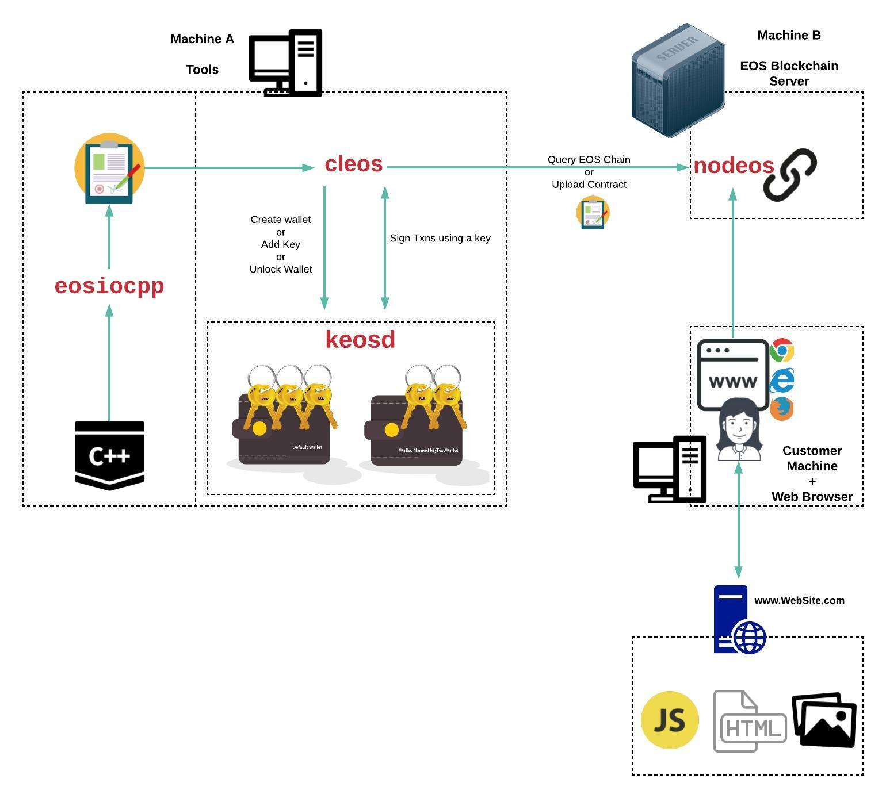

#### Summary

The EOS software stack has a number of tools. Many of the tutorials we've seen explain how to run everything on a single machine. This can be confusing becasue the reader tends to lose sight of how it all fits together. 

The below image shows how these tools are normally distributed. The tools names are written in **BIG RED** letters in the images. Here's a quick summary:

* **eosiocpp** - A compiler which allows you to compile your C++ into a format that can be uploaded to the blockchain. 
* **cleos** - A commandline tool used to upload your contracts to the blockchain and query the blockchain. 
* **keosd** - A wallet manger which runs as a daemon. The cleos tool interacts with this to sign requests (needed so that your requests to the blockchain can be trusted). 
* **nodeos** - The server software that runs the blockchain itself.

{}
As you step through the rest of this site, we assume that you are running **nodeos** on a machine/server and using the rest of the tools from another machine. While this seems inconvenient at 1st, it'll make some concepts a lot clearer. 
{}

