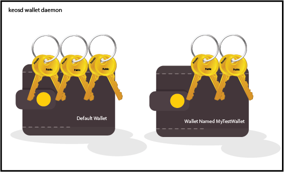

* [Start the keosd background process]()
* [Create a wallet]()
* [Wallets need to be opened]()
* [Unlocking your wallet]()
* [Adding keys]()
* [Working with multiple wallets]()


### Introduction

There are currently two wallet options available:

* A plugin that you're able to start with the nodeos server.
* A standalone daemon that can be run on a seperate server, independent from the nodeos server. **<< We're going to be using this option**

> **DO NOT SUPPLY THE FOLLOWING WHEN STARTING THE nodeos server:** --plugin eosio::wallet_api_plugin

### Important concept

Many people involved in Crypto think about a wallet as something that stores "Tokens". This is not the correct way of thinking about the wallet.


The wallet is just a place where key pairs are stored.

The image below illustrates that the keosd daemon can have multiple wallets and each wallet can hold multiple public+private key pairs



### 1. Start the keosd background process {#keosd}

The wallet we'll be discussing is a daemon called keosd

To run the wallet daemon simply run the executable. Note that if you're using docker images and are following the [docker instructions](../software/docker/#Running), then you already have a docker container running the wallet daemon. 

```
cd eos/build/programs/keosd/
./keosd
```

{}
By default keosd runs on port 8888. This is the same port the nodeos application uses by default, so if you're running this on the same machine you'll need to supply the something like this to run on port 8899  "./keosd --http-server-address=localhost:8899"
{}

If you are running the server for the 1st time, you need to auto generate an INI file in the default "config" folder  ~/eosio-wallet/config.ini

### 2. Create a wallet {#create}

Let's create a default wallet: 

```
$cleos --wallet-url http://wallet:5555 wallet create

Creating wallet: default
Save password to use in the future to unlock this wallet.
Without password imported keys will not be retrievable.
"PW5Kewn9L76X8Fpd....................t42S9XCw2"
```

{}
Save this password somewhere safe and label it as: DEFAULT WALLET PASSWORD 
{}

By default wallets are stored in ~/eosio-wallet/default.wallet. If you're following the docker instructions and you'd like to SSH into your wallet docker container to explore the file system and see this file, you can run the following from a new command prompt: "docker exec -it wallet bash"

{}
Note that the EOS master key has been added to this wallet for you. Don't be confused by this, all you have done to this point is create a wallet - and you now have a password to unlock that wallet. 
{}

Let's take a look at what's in the wallet.

```
$cleos --wallet-url http://wallet:5555 wallet keys
[[
    "EOS6MRyAjQq8ud7hVNYcfnVPJqcVpscN5So8BhtHuGYqET5GDW5CV",
    "5KQwrPbwdL6PhXujxW37FSSQZ1JiwsST4cqQzDeyXtP79zkvFD3"
  ]
]
```

As you can see, there is one key pair in your newly created wallet. This is the master keypair for the sole initial account, **eosio**

**Don't confuse the above master key with keys that you'll be adding in future**

### 3. Wallets need to be opened {#open}

Something that can be a little confusing is that wallets that are not "open" are not listed when using the "list" command. Here's an example:

Let's start by killing and restarting the keosd process.
```
$ pkill keosd
$ ./keosd
```
We can now see that using the list command returns nothing ... where'd my wallet go?

```
$cleos --wallet-url http://wallet:5555 wallet list

Wallets:
[]
```

The catch is, the wallet needs to be "opened" before it'll show up in your list of wallets (something that can be improved in my opinion)

```
$cleos --wallet-url http://wallet:5555 wallet open

$cleos --wallet-url http://wallet:5555 wallet list

Wallets:
[
  "default"
]
```


### 4. Unlocking your wallet {#unlock}

Simply having your wallet open doesn't do much for you, you now need to UNLOCK the wallet.

```
$cleos --wallet-url http://wallet:5555 wallet unlock

#{You'll need to provide your password here}
password: Unlocked: default
```

Note how when I list the wallet now, there's a * next to the name, indicating that it's been unlocked.
```
$cleos --wallet-url http://wallet:5555 wallet list
Wallets:
[
  "default *"
]
```

{}
Note that when you created your wallet using the "./cleos wallet create" in step 2 above, your wallet was left in an Open and Unlocked state. What tends to happen is things work as you're following a tutorial, but things don't work after a reboot. If you don't understand this need to Open and then unlock the wallet before it can be used, you'll be confused at some point.
{}


### 5. Adding keys {#AddingKeys}

As detailed in the [Accounts](../accounts/] section, each account has two permissions the **owner** and the **active** permission.

So in most cases you'll want to create two keys so that you can associate one key with each permission (more on this later).

The "create key" command below just prints a key pair to screen. It's not stored, so you'll need to import these keys into a wallet.

```
$cleos create key
Private key: 5JKrSzsuztAPvTzghi9VU4522sT49SeE3XVHbB8HsfC3ikifJRf
Public key: EOS7EzCEh94uN2k59wznzsZDcFVnpZ3wuiYvPSbb8bXDS6U7twKQF


$cleos create key
Private key: 5KgcXVKU7Lfs2iFpAP1Aqiz3SEZcmbLuh6y9Lvsi4bYcFwDUVBQ
Public key: EOS5tJQSKKeiTUZEutPo9SWUoCeovV43kWxGuW21K663frcHw7GnN
```

Now let's import the keys into our wallet.

```
$cleos --wallet-url http://wallet:5555 wallet import 5JKrSzsuztAPvTzghi9VU4522sT49SeE3XVHbB8HsfC3ikifJRf
imported private key for: EOS7EzCEh94uN2k59wznzsZDcFVnpZ3wuiYvPSbb8bXDS6U7twKQF


$cleos --wallet-url http://wallet:5555 wallet import 5KgcXVKU7Lfs2iFpAP1Aqiz3SEZcmbLuh6y9Lvsi4bYcFwDUVBQ
imported private key for: EOS5tJQSKKeiTUZEutPo9SWUoCeovV43kWxGuW21K663frcHw7GnN
```

If we look at our wallet now, we can see 3 public keys. The single master key that was added when we created the wallet and the two keys that we just imported. 

```
./cleos --wallet-url http://wallet:5555 wallet keys
[
    "EOS5tJQSKKeiTUZEutPo9SWUoCeovV43kWxGuW21K663frcHw7GnN",
    "EOS6MRyAjQq8ud7hVNYcfnVPJqcVpscN5So8BhtHuGYqET5GDW5CV",
    "EOS7EzCEh94uN2k59wznzsZDcFVnpZ3wuiYvPSbb8bXDS6U7twKQF"
]
```

We can query for the key pairs as well, this request will ask for the wallet password.

```
./cleos --wallet-url http://wallet:5555 wallet private_keys
password:
[[
    "EOS5tJQSKKeiTUZEutPo9SWUoCeovV43kWxGuW21K663frcHw7GnN",
    "5KgcXVKU7Lfs2iFpAP1Aqiz3SEZcmbLuh6y9Lvsi4bYcFwDUVBQ"
  ],[
    "EOS6MRyAjQq8ud7hVNYcfnVPJqcVpscN5So8BhtHuGYqET5GDW5CV",
    "5KQwrPbwdL6PhXujxW37FSSQZ1JiwsST4cqQzDeyXtP79zkvFD3"
  ],[
    "EOS7EzCEh94uN2k59wznzsZDcFVnpZ3wuiYvPSbb8bXDS6U7twKQF",
    "5JKrSzsuztAPvTzghi9VU4522sT49SeE3XVHbB8HsfC3ikifJRf"
  ]
]
```

{}
As we stated above, it's important to keep track of which key your planning on using for what purpose. When you store your keys, clearly label the keys as per the example below
{}

**By labeling our new keys as follows, you'll be a lot less likely to get the keys mixed up as you develop.**

```

    eosio Public Key: "EOS5tJQSKKeiTUZEutPo9SWUoCeovV43kWxGuW21K663frcHw7GnN",
    eosio Private Key: "5KgcXVKU7Lfs2iFpAP1Aqiz3SEZcmbLuh6y9Lvsi4bYcFwDUVBQ"

    MyNewAccount owner Public Key: "EOS6MRyAjQq8ud7hVNYcfnVPJqcVpscN5So8BhtHuGYqET5GDW5CV",
    MyNewAccount owner Private Key: "5KQwrPbwdL6PhXujxW37FSSQZ1JiwsST4cqQzDeyXtP79zkvFD3"

    MyNewAccount active Public Key: "EOS7EzCEh94uN2k59wznzsZDcFVnpZ3wuiYvPSbb8bXDS6U7twKQF",
    MyNewAccount active Private Key: "5JKrSzsuztAPvTzghi9VU4522sT49SeE3XVHbB8HsfC3ikifJRf"
```

### 6. Working with multiple wallets {#MultipleWallets}

The keosd daemon allows you to have multiple wallets.

While not covered in detail here, most of the above commands take params allowing you to specify the name of the wallet you want to interact with. Example:

```
$cleos --wallet-url http://wallet:5555 wallet create -n MyTestWallet
$cleos --wallet-url http://wallet:5555 wallet import 5KgcXVKU7Lfs2iFpAP1Aqiz3SEZcmbLuh6y9Lvsi4bYcxxxxxxxx -n MyTestWallet
```

https://github.com/EOSIO/eos/wiki/Tutorial-Getting-Started-With-Contracts


##### Credits
The image of the wallet and the keys were used under free license from freepic
<a href="https://www.freepik.com/free-vector/flat-key-background_1637044.htm">Image 1</a>
<a href='https://www.freepik.com/free-vector/dollar-coins_759113.htm'>Image 2</a>

Much of this information can also be found here: https://github.com/EOSIO/eos/wiki/Tutorial-Getting-Started-With-Contracts
