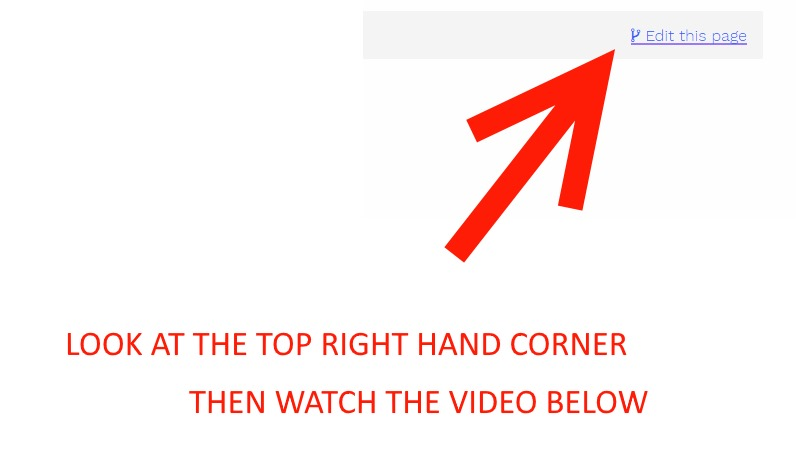

 

### Telegram

If you're not sure about an edit and want to talk about the change 1st : [EOSDocs.io Telegram Channel](https://t.me/eosdocs) 

### Find something wrong, update it!

https://github.com/BinaryFocus/eosdocs.io

Without any knowlege of git, you can find the page you'd like to edit within the [PublicWebsite folder](https://github.com/BinaryFocus/eosdocs.io/tree/master/PublicWebsite/content) and then create a pull request. 

Here's a quick video showing how to edit the content of this site. 

 
<iframe width="560" height="315" src="https://www.youtube.com/embed/Vq1UwMbeJ2w" frameborder="0" allow="autoplay; encrypted-media" allowfullscreen></iframe>

